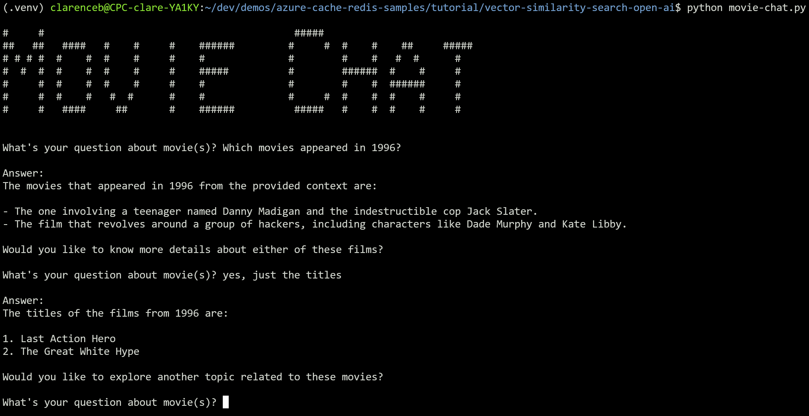
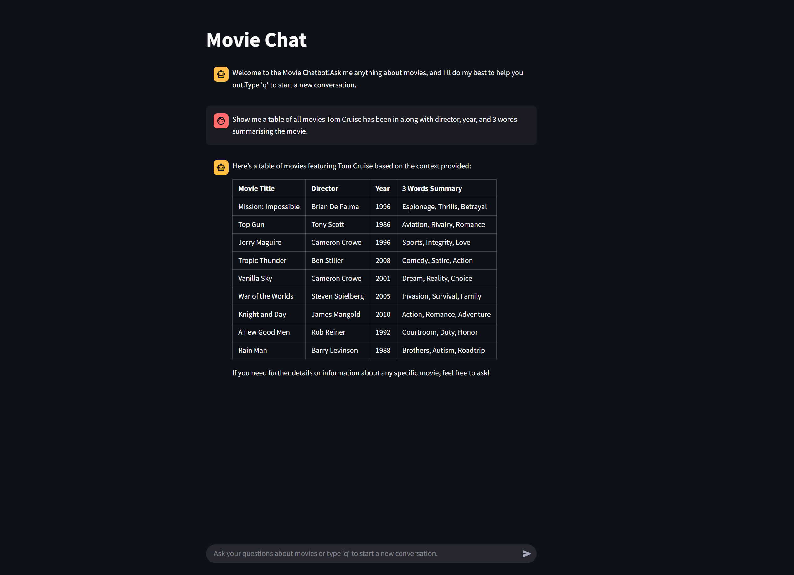
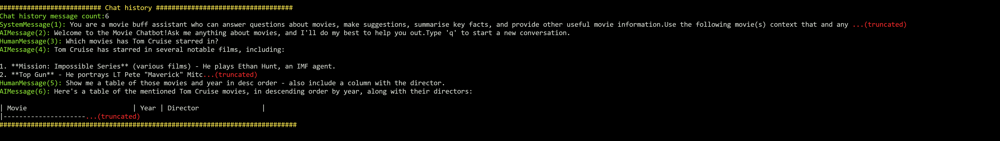
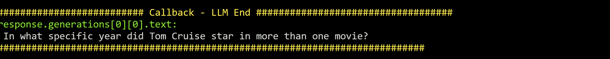
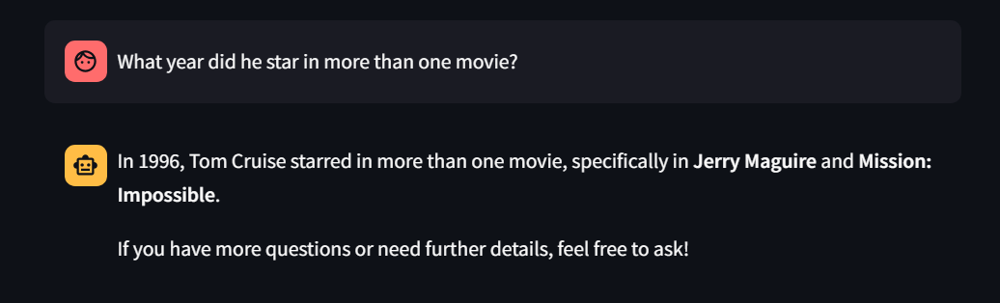
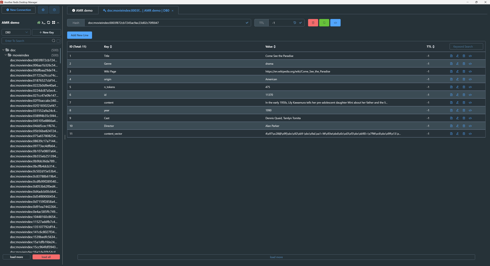

# Demo Steps

This demo has moved to: https://github.com/clarenceb/movie-chat

## Setup Python Virtual Environment

```sh
python -V
# Python 3.12.3

python -mvenv .venv

source .venv/bin/activate
pip install -r requirements.txt
```

## Install VSCode extensions

* Python (Microsoft)
* Python Environments (Microsoft)
* Jupyter (Microsoft)

## Create Azure Resources

### Azure Managed Redis and Azure OpenAI Service deployment

Create the Azure sources:

```sh
RESOURCE_GROUP=movie-chat-amr
DEPLOYMENT_NAME=movie-chat-amr
LOCATION=australiaeast

az group create -n $RESOURCE_GROUP -l $LOCATION
az deployment group create -g $RESOURCE_GROUP -n $DEPLOYMENT_NAME --template-file main.bicep
```

## Create a `.env` file with these values

```sh
API_KEY=xxxxxxxxxxxxxxxxxxxxxxxxxxxxxxxxxxxxx
RESOURCE_ENDPOINT=https://xxxxxxxxxxxxxxx.openai.azure.com
DEPLOYMENT_NAME=text-embedding-3-large
MODEL_NAME=text-embedding-3-large
REDIS_ENDPOINT=xxxxxxxxxxx.<region>.redis.azure.net:10000
REDIS_PASSWORD=xxxxxxxxxxxxxxxxxxxxxxxxxxxxxx
```

Or use the helper script:

```sh
./setup-env.sh
```

## Open Jupyter notebook

Select the `.venv/bin/python` virtual environment for the Kernel.

Execute each of the cells.

## Run the movie chat (console app)

```sh
python movie-chat.py

# What movies has Tom Cruise been in?
# What actor did I just ask about?
# What years has he been in movies?
# Just display the years as a comma-separate list and nothing else
# Tell me about Top Gun
# q
```



## Run the movie chat (Streamlit UI app)

```sh
streamlit run movie-chat-ui.py
```



## View debugging info (cli or streamlit) in console

```sh
DEBUG=1 python movie-chat.py
# or
DEBUG=1 streamlit run movie-chat-ui.py
```



See the question rewriting in action which happens in the due to the `history_aware_retriever`:

```python
history_aware_retriever = create_history_aware_retriever(
    llm, retriever, contextualize_q_prompt
)
```

**Question**: Which movies has Tom Cruise starred in?

List of movies...

**Question**: in what year did he appear in more than one movie?

Gets rewritten to...



Result in the app:



## Query movie index using Redis Vector Library (RedisVL)

```sh
pip install redisvl

redis_url="rediss://:<access-key>@<cache-name>.<region>.redis.azure.net:10000"

rvl index listall -u $redis_url
rvl index info -i movieindex -u $redis_url
rvl stats -i movieindex -u $redis_url
```

")

## View movie index with Another Redis Desktop Manager



## TODO

* Azure Developer CLI
* Deploy app to Container apps
* Add support to the app for:
    * OpenAI Assistants - maintain chat thread / history
    * Render charts with Markdown JS
    * Code interpreter to generate diagrams and display them
* Tool to search bing images for a image of an actor and can display that in the chat
